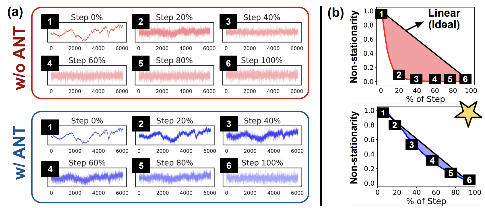

# ANT: Adaptive Noise Schedule for Time Series Diffusion Models

### Seunghan Lee, Kibok Lee, Taeyoung Park

<br>

This repository contains the official implementation for the paper [ANT: Adaptive Noise Schedule for Time Series Diffusion Models]([https://arxiv.org/abs/xxxxx](https://arxiv.org/abs/xxx)) 

This work is accepted in 
- [NeurIPS 2024](https://arxiv.org/abs/xxx).

<p align="center">

</p>


<br>

## 1. Installation

Create a conda environment

```
conda create --name ANT --yes python=3.8 && conda activate ANT

pip install --editable "."
```

<br>

## 2. Calculation of ANT score

Refer to `ANT_score.ipynb`

<br>

## 3. Three Downstream Tasks

Example)

- Dataset: `M4`
- Scheduler: `Cos(T=100, tau=1.0)`

<br>

### 1) TS Forecasting

**a) Standard horizon ($H$)**

- Train

```sh
python bin/train_model.py -c configs/train_tsdiff/train_m4_hourly.yaml --schedule cosine --tau 1.0 --timesteps 100 --time_embed 1 --is_train 1 --train_scale 1
```

<br>

- Test

```sh
python bin/train_model.py -c configs/train_tsdiff/train_m4_hourly.yaml --schedule cosine --tau 1.0 --timesteps 100 --time_embed 1 --is_train 0 --test_scale 16.0 --train_scale 1
```

<br>

**b) Variable horizons ($\alpha \cdot H$)**

- Train ( where $\alpha=2$)

```sh
python bin/train_model.py -c configs/train_tsdiff/train_m4_hourly.yaml --schedule cosine --tau 1.0 --timesteps 100 --pred_alpha 2.0 --time_embed 1 --is_train 1 --train_scale 1
```

- Test

```sh
python bin/train_model.py -c configs/train_tsdiff/train_m4_hourly.yaml --schedule cosine --tau 1.0 --timesteps 100 --pred_alpha 2.0 --time_embed 1 --is_train 0 --test_scale 32.0 --train_scale 1
```

<br>

### 3-2) TS Refinement

Load pretrained weights trained from **3-1) TS Forecasting**

```sh
python bin/refinement_experiment.py -c configs/refinement/m4_hourly-linear.yaml --timesteps 100 --schedule cosine --tau 1.0 --time_embed 1 --ckpt saved_weights/results_T100_cosine_1.0_w_DE/m4_hourly/lightning_logs/version_0/checkpoints/last.ckpt
```

<br>

### 3-3) TS Generation

Load pretrained weights trained from **3-1) TS Forecasting**

```sh
python bin/tstr_experiment.py -c configs/tstr/m4_hourly.yaml --ckpt saved_weights/results_T50_linear_0.0_wo_DE/m4_hourly/lightning_logs/version_0/checkpoints/last.ckpt --schedule cosine --timesteps 100 --tau 1.0 --time_embed 1
```

<br>

## Acknowledgement

We appreciate the following github repositories for their valuable code base & datasets:

https://github.com/amazon-science/unconditional-time-series-diffusion